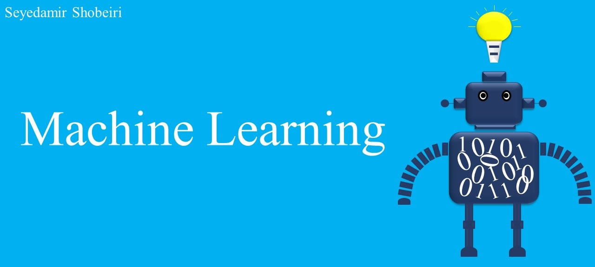

  

<b>Hello and thanks for stopping by!</b>

My name is Seyedamir Shobeiri.
I graduated in Bachelor’s degree in Computer engineering from Islamic Azad University of Zanjan in 2022.I work on different problems in machine learning and throughout my bachelor journey, I have done research on equitable methods for data valuation, algorithms to interpret machine learning models, and ways to make existing ML predictors fairer.

- 🌱 I’m currently work on Reinforcement Learning

